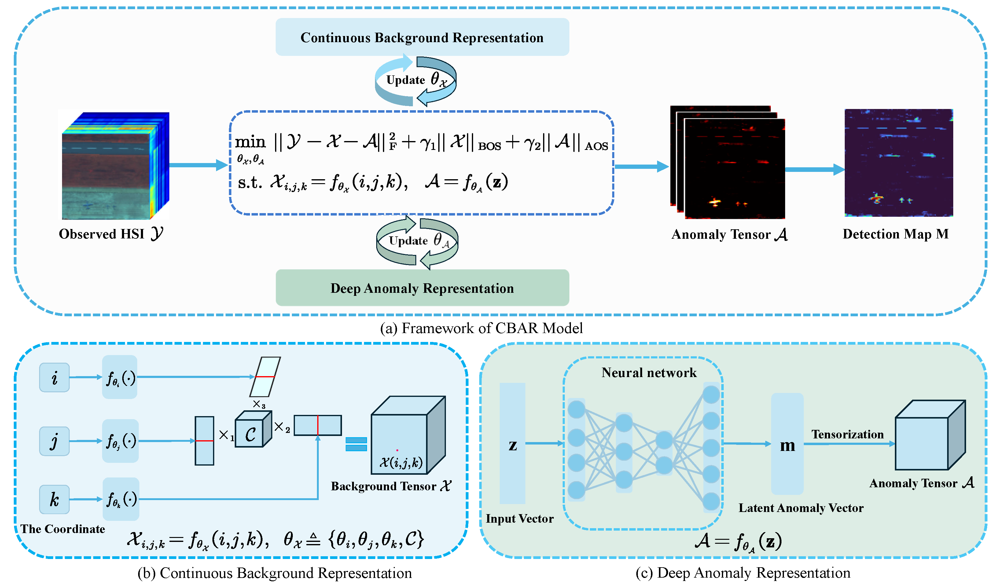

# Continuous Tensor Representation for Hyperspectral Anomaly Detection

> Hyperspectral anomaly detection is an important task in remote sensing for identifying pixels with anomalous spectral signatures that deviate from their local background. Recently, low-rank and sparse representation-based methods have garnered significant attention in hyperspectral anomaly detection, which typically employ low-rank representation to characterize the background and sparse representation to capture anomalies. Since the background and anomalies usually exhibit complex characteristics beyond the low-rankness and sparsity, low-rank and sparse representation-based methods typically do not perform satisfactorily for complex scenarios. To address the challenge, we propose an unsupervised hyperspectral anomaly detection method from a continuous perspective, which organically integrates Continuous Background representation and deep Anomaly Representation (CBAR). Specifically, the CBAR model leverages the continuous low-rank tensor function to encapsulate both the low-rankness and smoothness of the background and the deep neural network to capture the complex geometric structure of anomalies. Moreover, to mitigate the overfitting of the background and anomalies to the observed HSI, we introduce two terms as overfit-shield by exploiting the prior knowledge of the background and anomalies. To solve the CBAR model, we develop an efficient alternating minimization algorithm. Extensive experiments on benchmark datasets (including Airport, Urban, Beach, and HYDICE) demonstrate that the proposed CBAR outperforms the state-of-the-art anomaly detection methods both qualitatively and quantitatively. 

